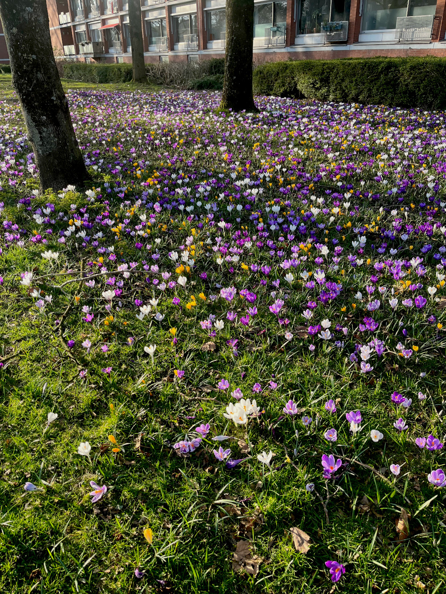

# Something a little more positive

In the last couple of years the world has has it's share of bad news. A lot of people died. Many have lost their jobs. At the time of writing this, Europe would be just over one week into another war which we all are still hoping will not escalate.

So, it's time to reflect also on some good in this time. The best I can do is share some photos and hope that who ever reads this can also find some joy I was blessed enough to capture in the moment.

I moved to the Netherlands in October 2021. Coming from Cape Town, South Africa, I was ill prepared for the winter here. The local news and weather services say this was one of the warmest winters... All I know is that it was still bitter cold for me. But in this past week, we were blessed with some beautiful sunny days and the following pictures are some pictures I took around Utrecht on various strolls.

