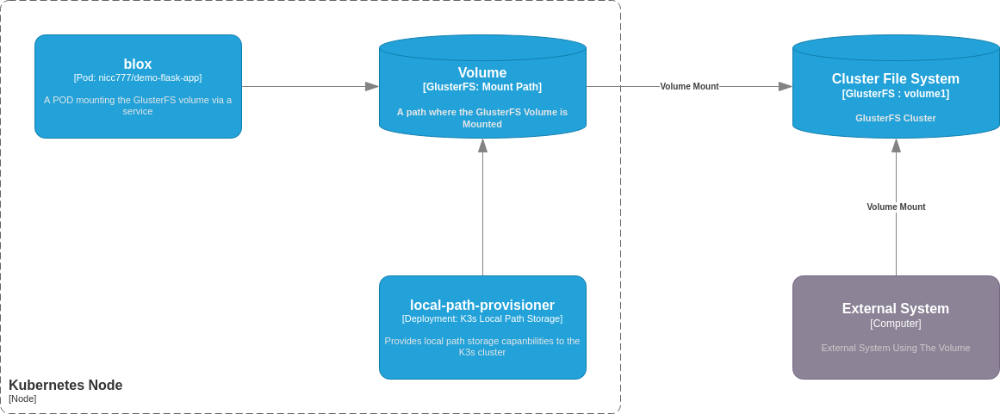

# Kubernetes Persistent Volumes

I have been really busy this month, hence not much materialized in terms of blog posts. Anyway, I took a short break and in this time I have experimented further with persistent volumes, using my [previous blog post](2022-05-07.md) as a base.

The idea is to add a persistent volume to a Pod using a clustered filesystem so that I can access the data the Pod produces from anywhere. As a test, I want to use a GlusterFS volume that is also mounted on my local host OS.

## K3s Caveats

It should be important to note that K3s is a _lightweight_ Kubernetes distribution and [excludes](https://rancher.com/docs/k3s/latest/en/storage/) certain plugins, like GlusterFS.

If you follow a typical [Kubernetes GlusterFS example](https://github.com/kubernetes/examples/tree/master/volumes/glusterfs), you will notice the following output when you run something like `kubectl describe pod/glusterfs`:

```text
Name:         glusterfs
Namespace:    pvtest

... some data omitted ...

Events:
  Type     Reason       Age                From               Message
  ----     ------       ----               ----               -------
  Normal   Scheduled    92s                default-scheduler  Successfully assigned pvtest/glusterfs to node2
  Warning  FailedMount  34s (x2 over 49s)  kubelet            Unable to attach or mount volumes: unmounted volumes=[glusterfsvol], unattached volumes=[kube-api-access-mkjv6 glusterfsvol]: failed to get Plugin from volumeSpec for volume "glusterfsvol" err=no volume plugin matched
  Warning  FailedMount  3s (x5 over 92s)   kubelet            Unable to attach or mount volumes: unmounted volumes=[glusterfsvol], unattached volumes=[glusterfsvol kube-api-access-mkjv6]: failed to get Plugin from volumeSpec for volume "glusterfsvol" err=no volume plugin matched
```

Since the plugin is not available, the Pod will never start or get into a ready state. I still plan to test the example in another environment at some point in time - perhaps that is also for another blog post... Time will tell.

According to the [K3s documentation](https://rancher.com/docs/k3s/latest/en/storage/) there are two options when using persistent volumes:

* Using a local storage provider, or
* Using Longhorn.

There is a nice [Longhorn on K3s for Raspberry Pi](https://rpi4cluster.com/k3s/k3s-storage-setting/) that will be great to follow, but I decided to first try a local storage provider as I though that I could expose GlusterFS volumes on each Node which in tern can then be used by the local storage provider.

## Lab Setup

The lab implementation will be based on K3s exposing persistent volumes using a local storage provider, which in turn mounted a GlusterFS volume.

Below is a simplified diagram of what I'm trying to accomplish. The diagram itself is based on the [C4 model deployment diagram](https://c4model.com/#DeploymentDiagram) example.



# Preparing the cluster for the local storage provider

Before deploying a pod, some preparation work is required. The next couple of steps will delve into the detail of the preparations of the k3s cluster.

## Preparing Nodes

As a pre-requisite I have my GlusterFS, as described in [my previous blog](2022-05-07.md), up and running.

The biggest task really was to prepare the GlusterFS setup on each node. I have [blogged previously](2022-04-03.md) about setting up k3s using multipass. I am using that as base and I have created an additional script ([available here](https://gist.githubusercontent.com/nicc777/164d5c65510d369248fa50c338a71ba7/raw/2297b5725d4b64bd9428d73375f4f3d1f3a7654e/install_glusterfs_clinet_on_k3s_nodes.sh)) to easily install the required packages and mount the GlusterFS volume.

To setup and mount the volume in the k3s nodes, simply run `bash install_glusterfs_clinet_on_k3s_nodes.sh`.

_**Note**_: In the next step it will become clear why the script creates the mount point on `/opt/local-path-provisioner`.

## Installing the local storage provider

To setup the local storage provider, I followed [this README](https://github.com/rancher/local-path-provisioner) and used the stable build, which was version 0.0.22 at the time of experimenting.

The installation command was run as it was on the README:

```shell
kubectl apply -f https://raw.githubusercontent.com/rancher/local-path-provisioner/v0.0.22/deploy/local-path-storage.yaml
```

Verify installation with the command `kubectl get all -n local-path-storage`:

```text
NAME                                          READY   STATUS    RESTARTS   AGE
pod/local-path-provisioner-7c795b5576-nklqr   1/1     Running   0          54s

NAME                                     READY   UP-TO-DATE   AVAILABLE   AGE
deployment.apps/local-path-provisioner   1/1     1            1           54s

NAME                                                DESIRED   CURRENT   READY   AGE
replicaset.apps/local-path-provisioner-7c795b5576   1         1         1       54s
```

The configuration is defined in a ConfigMap which expects the local storage to be at `/opt/local-path-provisioner`. This is why the previous step mounted the GlusterFS volume on this mount point.

# Testing

For the test I used a simple Pod manifest as can be seen below:

```yaml
apiVersion: v1
kind: Pod
metadata:
  name: blox
spec:
  containers:
  - name: flask-demo-app
    image: nicc777/demo-flask-app:0.0.2
    imagePullPolicy: IfNotPresent
    volumeMounts:
    - name: volv
      mountPath: /data
    ports:
    - containerPort: 80
  volumes:
  - name: volv
    persistentVolumeClaim:
      claimName: local-path-pvc
```

Save this as a file, for example in `blox-pod.yaml` and apply with the following commands:

```shell
# Create a namespace
kubectl create namespace pvtest

# Create a persistent volume claim
kubectl create -f https://raw.githubusercontent.com/rancher/local-path-provisioner/master/examples/pvc/pvc.yaml -n pvtest

# Create a Pod, using the persistent volume claim
kubectl apply -f blox-pod.yaml -n pvtest
```

The pod should be running after a minute or so (depending on Internet bandwidth). A `kubectl get all -n pvtest` should show the following:

```text
NAME       READY   STATUS    RESTARTS   AGE
pod/blox   1/1     Running   0          2m15s
```

## Discover details about the persistent volume claim

First, let's describe the Pod with `kubectl describe pod/blox -n pvtest`. The output (shortened) may look something like this:

```text
Name:         blox
Namespace:    pvtest
Priority:     0
Node:         node2/10.0.50.222

... some data omitted ...

Volumes:
  volv:
    Type:       PersistentVolumeClaim (a reference to a PersistentVolumeClaim in the same namespace)
    ClaimName:  local-path-pvc
    ReadOnly:   false

... some data omitted ...
```

Now, lets have a look at the persistent volume with `kubectl describe PersistentVolumeClaim local-path-pvc -n pvtest`:

```text
Name:          local-path-pvc
Namespace:     pvtest
StorageClass:  local-path
Status:        Bound
Volume:        pvc-d8bfe66a-1954-4bc2-a7c0-fa8753b2e86d
Labels:        <none>
Annotations:   pv.kubernetes.io/bind-completed: yes
               pv.kubernetes.io/bound-by-controller: yes
               volume.beta.kubernetes.io/storage-provisioner: rancher.io/local-path
               volume.kubernetes.io/selected-node: node2
Finalizers:    [kubernetes.io/pvc-protection]
Capacity:      128Mi
Access Modes:  RWO
VolumeMode:    Filesystem
Used By:       blox
Events:
  Type    Reason                 Age                From                                                                                                Message
  ----    ------                 ----               ----                                                                                                -------
  Normal  WaitForFirstConsumer   14m (x2 over 14m)  persistentvolume-controller                                                                         waiting for first consumer to be created before binding
  Normal  ExternalProvisioning   14m (x2 over 14m)  persistentvolume-controller                                                                         waiting for a volume to be created, either by external provisioner "rancher.io/local-path" or manually created by system administrator
  Normal  Provisioning           14m                rancher.io/local-path_local-path-provisioner-7c795b5576-xkpk4_e577fe62-821d-4a69-ac5a-42d01042716a  External provisioner is provisioning volume for claim "pvtest/local-path-pvc"
  Normal  ProvisioningSucceeded  14m                rancher.io/local-path_local-path-provisioner-7c795b5576-xkpk4_e577fe62-821d-4a69-ac5a-42d01042716a  Successfully provisioned volume pvc-d8bfe66a-1954-4bc2-a7c0-fa8753b2e86d
```

Important things to note:

* Both the POD and the Persistent Volume have to run on the same node - in this case on Node 2. Usually this will be managed automagically, but there are ways to control this very precisely. However, I thought that would also be fine to look at in a seperate blog post, so I will not dig deeper into the concept of affinity right now.
* Note the persistent volume `Volume` label: `pvc-d8bfe66a-1954-4bc2-a7c0-fa8753b2e86d`. This is important, as this will also be the name of the directory created in the GlusterFS volume where all the actual data will be stored.
  * _**Important Warning**_: If you delete the Persistent Volume Claim, this reference will be gone! It will be hard to re-use this again, so make sure you pay attention when deleting such claims!

## Use the Persistent Volume from a pod

For this part of the experiment, the commands will be run in a shell on the deployed Pod.

Now, let's see if we have a mounted volume:

```shell
# Get a bash session
kubectl  exec pod/blox -n pvtest -it -- bash

# Once in the Pod, check out the mounts and verify /data is mounted
root@blox:/usr/src/app# df -h
Filesystem          Size  Used Avail Use% Mounted on
overlay              12G  5.0G  6.5G  44% /
tmpfs                64M     0   64M   0% /dev
tmpfs               3.9G     0  3.9G   0% /sys/fs/cgroup
glusterfs1:volume1   12G  2.2G  9.3G  20% /data
/dev/sda1            12G  5.0G  6.5G  44% /etc/hosts
shm                  64M     0   64M   0% /dev/shm
tmpfs               7.8G   12K  7.8G   1% /run/secrets/kubernetes.io/serviceaccount
tmpfs               3.9G     0  3.9G   0% /proc/acpi
tmpfs               3.9G     0  3.9G   0% /proc/scsi
tmpfs               3.9G     0  3.9G   0% /sys/firmware

# Check if we can store data:
echo TEST123 > /data/blox-test.txt

# Check the data locally:
cat /data/blox-test.txt
```

## Verify the data from outside the Pod

Let's have a look at what happened in the actual volume from another system. 

On my local development system, I have mounted the GlusterFS volume on `/glusterfs-data`. If I do a directory listing with `ls -lahrt /glusterfs-data` I will see the following:

```text
drwxr-xr-x 23 root    root    4.0K May  7 15:40 ..
drwxrwxrwx  5 root    root    4.0K May  7 15:40 .
drwxr-xr-x  2 nicc777 nicc777 4.0K May  7 15:41 nicc777
-rw-rw-r--  1 nicc777 nicc777  537 May 25 10:17 testfile
drwxrwxrwx  2 root    root    4.0K May 25 10:59 pvc-d8bfe66a-1954-4bc2-a7c0-fa8753b2e86d_pvtest_local-path-pvc
```

And let's see if I can see the test data file I created from the pod with the command: `sudo cat /glusterfs-data/pvc-d8bfe66a-1954-4bc2-a7c0-fa8753b2e86d_pvtest_local-path-pvc/blox-test.txt`:

```text
TEST123
```

There are some other directories and files not related to this test. However, the persistent volume claim has created a sub-directory called `pvc-d8bfe66a-1954-4bc2-a7c0-fa8753b2e86d_pvtest_local-path-pvc`. You should be able to now see how the how the directory name is derived, based on the previous observations of the persistent volume claim and the actual manifest for the Pod.

I also noted it takes a while for the directory to become visible on my local system (more than a minute in my case). This is just time it takes for GlusterFS to ensure in synchronizes everything properly before actually making it visible on a local mount point. Various factors may influence the speed at which this happens, including disk I/O speed, network speed etc.

If you know where to look, the data created in the Pod is visible now anywhere where the GlusterFS volume is mounted. This is exactly what I wanted to accomplish!

# Conclusion: what can we learn from this simple experiment?

There are so many details that can be explored, but I will try to keep it simple by summarizing it using the following important observations:

* Persistent volumes has many possible implementations in Kubernetes. It is important that you understand your requirements before blindly selecting an option. The choice between a highly available clustered file system versus just a simple local file system (any several other options in between) is just one criteria to consider.
* The kubernetes distribution you use also matters as not all persistent volume implementations may work. K3s, for example, has very limited support and something like GlusterFS which I wanted to use was not supported out of the box.
* Sometimes you have to be creative to solve a problem given certain limitations. Even though GlusterFS is not natively supported by K3s, I was still able to make it work and accomplish my end-goal.

I hope this blog post gave you something interesting to think about in your own research and experimentation with persistent volumes. I hope I can expand on this topics in other scenarios in the near future.

# Tags

file-systems, kubernetes, persistent volumes, pv

<div id="disqus_thread"></div>
<script>
    /**
    *  RECOMMENDED CONFIGURATION VARIABLES: EDIT AND UNCOMMENT THE SECTION BELOW TO INSERT DYNAMIC VALUES FROM YOUR PLATFORM OR CMS.
    *  LEARN WHY DEFINING THESE VARIABLES IS IMPORTANT: https://disqus.com/admin/universalcode/#configuration-variables    */
    /*
    var disqus_config = function () {
    this.page.url = PAGE_URL;  // Replace PAGE_URL with your page's canonical URL variable
    this.page.identifier = PAGE_IDENTIFIER; // Replace PAGE_IDENTIFIER with your page's unique identifier variable
    };
    */
    (function() { // DON'T EDIT BELOW THIS LINE
    var d = document, s = d.createElement('script');
    s.src = 'https://nicc777.disqus.com/embed.js';
    s.setAttribute('data-timestamp', +new Date());
    (d.head || d.body).appendChild(s);
    })();
</script>
<noscript>Please enable JavaScript to view the <a href="https://disqus.com/?ref_noscript">comments powered by Disqus.</a></noscript>
