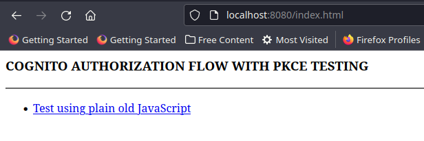
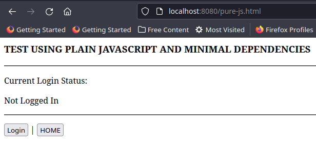
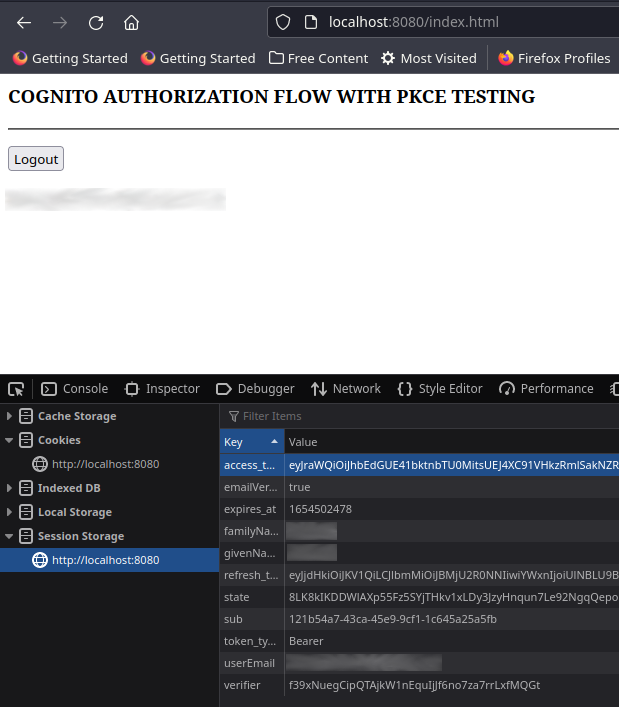
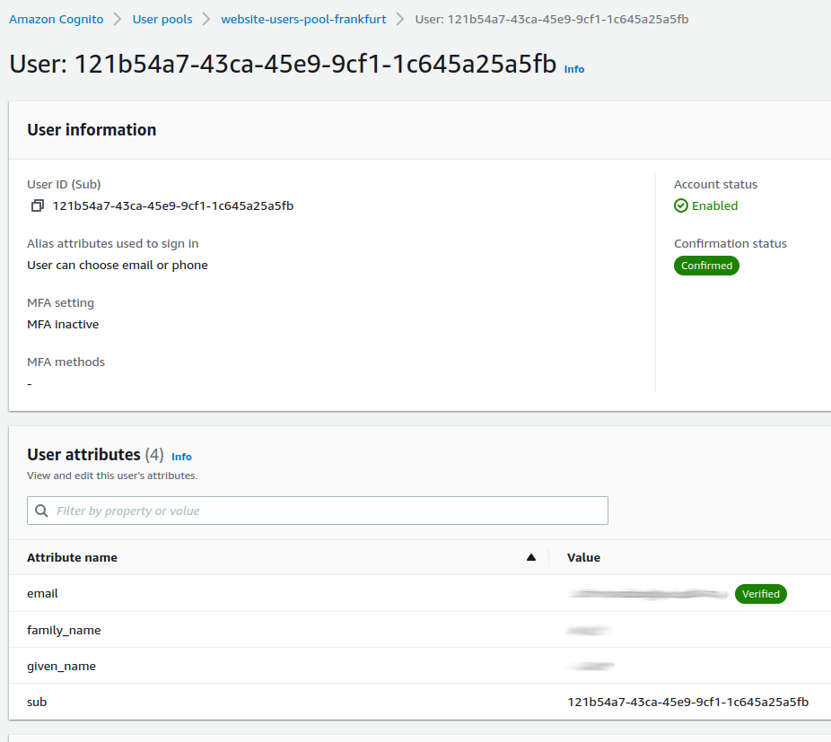
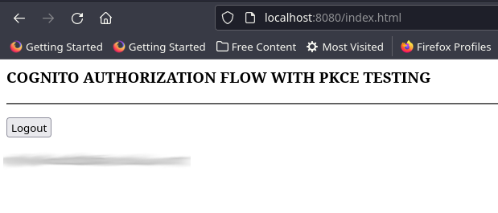

# AWS Cognito Web App in Pure JavaScript

Back in the early days of the World Wide Web, implementing user authentication was very straight forward. I remember a time where we only used a simple HTML page with a username and password field that was submitted to a CGI application which would check the password against something stored in a database and then issue a cookie. Both [Cookies](https://en.wikipedia.org/wiki/HTTP_cookie) and [HTTPS](https://en.wikipedia.org/wiki/HTTPS) were born out of [Netscape Communications](https://en.wikipedia.org/wiki/Netscape), but it would take a long time before HTTPS was widely adopted. Therefore, in the late 90's and early 2000's the WWW was the Wild West and it is always amazing to me to reflect on just how far we have come.

Today, user authentication is a lot more complex and it is much harder today to properly secure the user authentication process in web applications. Thankfully web frameworks and SDK's have made the process easy, but it still helps to understand the nuts and bolts. This blog post explores the nuts and bolts in the context of what is these days considered a standard flow for authenticating users using a web application: OAUTH2 Authorization Code flow with PKCE.

## What is this all about?

In a nutshell:

> This is a detailed walk through with an example web application that will authenticate an already registered and verified user in AWS Cognito in a Web Application using the OAUTH2 Authorization Code flow with PKCE, using pure JavaScript and not relying at all on any AWS SDK's

That was still a mount full, so let's break that down in smaller junks with a little more detail.

The example web implementation I refer to is also [available on GitHub](https://github.com/nicc777/aws-cognito-pure-js-example) and all discussions will be referring to this code base, unless otherwise stated.

The idea is to use [AWS Cognito](https://aws.amazon.com/cognito/) to authenticate our web users. That means users that register will have their profiles stored in AWS. This is convenient for several reasons:

* AWS, with their [shared responsibility model](https://aws.amazon.com/compliance/shared-responsibility-model/), takes care of the user pool management and security. All required from the web application is to integrate using the available API's and/or SDK's (the latter is not used, because I wanted to understand the implementation and flow in a more detailed level). 
* The JWT tokens issued by AWS can be used to integrate to other services like [AWS API Gateway](https://docs.aws.amazon.com/apigateway/latest/developerguide/apigateway-integrate-with-cognito.html) and [AWS CloudFront](https://aws.amazon.com/blogs/networking-and-content-delivery/authorizationedge-how-to-use-lambdaedge-and-json-web-tokens-to-enhance-web-application-security/) (the links point to some actual integration examples on AWS).
* AWS Cognito provide a host of API functions that can be used, for example there are end-points to obtain user attributes and an endpoint to force a logout (revoking an Access Token).

This blog post and experimental steps are based on an AWS blog post titled _[Understanding Amazon Cognito user pool OAuth 2.0 grants](https://aws.amazon.com/blogs/mobile/understanding-amazon-cognito-user-pool-oauth-2-0-grants/)_.

For this experiment an AWS Cognito user pool was must exist already with at least one user registered and confirmed. I will not delve into the detail of the steps, but I will share some key configuration decisions that are important.

The web application is a very straight forward HTML and JavaScript application without using any modern frameworks or SDK's. My aim was to go "_raw_" so that I could follow the steps in as much detail as possible. I take this approach whenever I want to really learn the nuts and bolts of something - it's definitely not required, but it does help when things go wrong and then trying to troubleshoot. Understanding the steps involved may at the very least help to pinpoint an issue you may experience when using an SDK with a framework of your choice.

A pure JavaScript implementation in this case means that I did not use any modern framework, but I did end up using some existing JavaScript projects that provided some key function (especially the cryptographic functions) as these are not the easiest thing in the world to implement from scratch and using the existing code is far more effective than trying to copy and paste all the working parts from StackOverflow or something similar. Also note that I am not a particularly proficient JavaScript developer, so the code may not be on any professional level - it simply has enough stuff to get the basic flow working.

_**Important Security Information**_: Based on the previous paragraph, it should therefore be noted at this stage that the code examples is not at all intended for a production environment. In fact, there are some known security issues that I will list below. To follow best practices and secure your application properly, please use the [AWS Amplify JavaScript SDK](https://docs.amplify.aws/lib/q/platform/js/) with your preferred web application framework.

Known Security Issues in this example code base:

* No verification of any of the JWT tokens is done
* The `state` is never validated within the flow
* No specific security measures have been taken to protect any private data
* The refresh token is never used as it was not part of the experiment (I might do a follow up article on this one...)

The experiment implements the [OAUTH2 Authorization Code flow with PKCE](https://oauth.net/2/grant-types/authorization-code/). Please note that [PKCE](https://oauth.net/2/pkce/) is an important addition and if you have a web application implementing Authorization Code flow, you really should also be implementing it with PKCE.

## Required Background Knowledge

This project should be ideal for JavaScript or web developers as a means to learn about AWS Cognito integration on a lower level. With that said, some general experience in the following technologies will help:

* HTML
* JavaScript
* AWS (general working knowledge)
* Docker (for running the test)
* The [OAUTH2](https://oauth.net/2/) and [OIDC](https://openid.net/specs/openid-connect-core-1_0.html) standards

## AWS Cognito Preparations

In order to actually use the code base yourself, You will need to create an AWS Cognito User Pool and define at least one web application.

Configuring the application is the tricky part, but full instructions are [available in the AWS Cognito Documentation](https://docs.aws.amazon.com/cognito/latest/developerguide/cognito-user-pools-app-idp-settings.html).

You will need to configure a "_Public Client_" and most of the defaults should be just fine. 

Add the following _**callback URL**_: `http://localhost:8080/callback.html`

Add the following _**sign-out URL**_: `http://localhost:8080/loggedout.html`

_**Note**_: All callback and sign-out URL's must be HTTPS except `localhost`, which is permitted to ne normal HTTP to allow testing from your local machine.

Include the following scopes:

* `aws.cognito.signin.user.admin`
* `email`
* `openid`
* `phone`
* `profile`

The `aws.cognito.signin.user.admin` scope is probably the most important for this test, as it is required to make API calls to the Cognito API for functions such as getting the user's profile (all their attributes) and to sign out a user. All operations for the API [are listed here](https://docs.aws.amazon.com/cognito-user-identity-pools/latest/APIReference/API_Operations.html) but not all these operations can be called with just the access token and the `aws.cognito.signin.user.admin` scope. I found a list of supported operations [on StackOverflow](https://stackoverflow.com/questions/53149091/what-does-the-aws-cognito-signin-user-admin-scope-mean-in-amazon-cognito) and duplicate the list here for convenience:


* [AssociateSoftwareToken](https://docs.aws.amazon.com/cognito-user-identity-pools/latest/APIReference/API_AssociateSoftwareToken.html)
* [ChangePassword](https://docs.aws.amazon.com/cognito-user-identity-pools/latest/APIReference/API_ChangePassword.html)
* [ConfirmDevice](https://docs.aws.amazon.com/cognito-user-identity-pools/latest/APIReference/API_ConfirmDevice.html)
* [DeleteUser](https://docs.aws.amazon.com/cognito-user-identity-pools/latest/APIReference/API_DeleteUser.html)
* [DeleteUserAttributes](https://docs.aws.amazon.com/cognito-user-identity-pools/latest/APIReference/API_DeleteUserAttributes.html)
* [ForgetDevice](https://docs.aws.amazon.com/cognito-user-identity-pools/latest/APIReference/API_ForgetDevice.html)
* [GetDevice](https://docs.aws.amazon.com/cognito-user-identity-pools/latest/APIReference/API_GetDevice.html)
* [GetUser](https://docs.aws.amazon.com/cognito-user-identity-pools/latest/APIReference/API_GetUser.html)
* [GetUserAttributeVerificationCode](https://docs.aws.amazon.com/cognito-user-identity-pools/latest/APIReference/API_GetUserAttributeVerificationCode.html)
* [GlobalSignOut](https://docs.aws.amazon.com/cognito-user-identity-pools/latest/APIReference/API_GlobalSignOut.html)
* [ListDevices](https://docs.aws.amazon.com/cognito-user-identity-pools/latest/APIReference/API_ListDevices.html)
* [SetUserMFAPreference](https://docs.aws.amazon.com/cognito-user-identity-pools/latest/APIReference/API_SetUserMFAPreference.html)
* [SetUserSettings](https://docs.aws.amazon.com/cognito-user-identity-pools/latest/APIReference/API_SetUserSettings.html)
* [UpdateDeviceStatus](https://docs.aws.amazon.com/cognito-user-identity-pools/latest/APIReference/API_UpdateDeviceStatus.html)
* [UpdateUserAttributes](https://docs.aws.amazon.com/cognito-user-identity-pools/latest/APIReference/API_UpdateUserAttributes.html)
* [VerifySoftwareToken](https://docs.aws.amazon.com/cognito-user-identity-pools/latest/APIReference/API_VerifySoftwareToken.html)
* [VerifyUserAttribute](https://docs.aws.amazon.com/cognito-user-identity-pools/latest/APIReference/API_VerifyUserAttribute.html)

In the sample code, `GetUser` and `GlobalSignOut` will be used.

For this specific test, the following attributes are required and needs to be defined in the setup of the user pool:

* `given_name`
* `family_name`
* `email`

Since you may be running in a sandbox environment for your messaging, you will need to pre-verify your e-mail address (and/or cellphone number).

Finally, pre-register at least one user you can use for testing. The code examples does not include user sign-up examples.

## A final word before we deep dive

I am not a JavaScript expert at all. In fact, my JavaScript knowledge is probably still on _beginner_ level as I only occasionally experiment in it. I am not a front-end guy, although the processes interest me and therefore I sometimes do crazy stuff like this. 

Therefore, if you are a more experienced JavaScript developer and you would like to optimize the example code, please feel free to make a pull request with your enhancements - I will be more than happy to consider your contributions to improve the overall project. However, I will ask to refrain from using SDK's as I would still like all code to be pure JavaScript.

# Testing the Web Application

Let's discuss the sample application [available on GitHub](https://github.com/nicc777/aws-cognito-pure-js-example) in a little more detail.

If you want to test the code yourself, and assuming you have created a Cognito User Pool and have set-up all the required values in the file `webapp.js`, you will need to run the following Docker command to start serving the web pages:

```shell
docker run --rm -p 8080:80 -v $(pwd):/usr/share/nginx/html nginx:latest
```

For best results, I recommend opening http://localhost:8080/index.html in a browser that has developer tools available (most modern web browsers), and then open the developer tools and ensure that you disable the cache for this site (you could potentially also use a plugin for disabling caching). You may also which to _persist logs_ in order to follow any network calls between domains.

## The landing page

The main page of the test application is located at http://localhost:8080/index.html



The landing page depends only on one JavaScript source file: `webapp.js` - this file contains all the common code of the application.

When the HTML page loads, it executes some JavaScript code to check if the user is logged in. Content is rendered based on the outcome of the test.

If the user is NOT logged in, a link to the login page is displayed. 

The check for a user's login status involves the following: Check if the following values have been set in the  browser's session storage:

* User's email address
* The access token
* The access token expires timestamp (not actually used at the moment - I still need to fix this...)

## The login page

This is another static page, named `pure-js.html`

When the page loads, it also checks if the user is logged in. If a user is found to be logged in, the page will redirect back to the home page (`index.html`). Again the common function `isLoggedIn()` is used for the check.

When the user is confirmed not to be logged in, a `Login` button is rendered and bound to an `onClick` event that will call `loginFunction()`.



Clicking the `Login` button will start the process, and in particular _Step 1_ of the _**authorization code grant**_ as explained on [this blog post from AWS](https://aws.amazon.com/blogs/mobile/understanding-amazon-cognito-user-pool-oauth-2-0-grants/) - the whole process is done in `loginFunction()`.

The `codeChallenge` is derived from a random value stored in the `codeVerifier` variable. Both values are saved in the session storage. All the calculated values are used to construct a URL that the user will be redirected to. This URL is hosted on AWS and if all checks passes, the Cognito Login page will be displayed.

Part of the constructed URL contains the callback URL which Cognito will be redirecting back to - regardless if an error occurs or if a user is successfully authenticated - more details on this process in a moment. However, please note that this callback URL must also be one of those defined in your Cognito application callback URL's. For this application it is `http://localhost:8080/callback.html`

Also note that the Cognito login page can be customized with a logo and some custom CSS - details available in the [AWS Documentation](https://docs.aws.amazon.com/cognito/latest/developerguide/cognito-user-pools-app-ui-customization.html).

## The callback page

When Cognito returns a user to the callback page there can be either an error condition or the user successfully logged in in which case we then need to retrieve the various tokens. If an error was returned, the error is rendered and any further processing stops.

However, another important check to do is to ensure the `state` value is the same value as generated during the process when the `loginFunction()` was called. Assuming the `state` value is the same as the current value in the session storage, the rest of the process can now continue.

Obtaining tokens is done by means of a API call in the background. This now corresponds to _Step 5_ of the _**authorization code grant**_ as explained on [this blog post from AWS](https://aws.amazon.com/blogs/mobile/understanding-amazon-cognito-user-pool-oauth-2-0-grants/). Processing is specific to the callback page and therefore all JavaScript code is on this page.

When the remote call to obtain the tokens are successful, the session information is stored in the browsers session storage.

_**Important Security Notice**_: Normally you would need to verify the returned JWT. This process is well documented in the [AWS documentation](https://docs.aws.amazon.com/cognito/latest/developerguide/amazon-cognito-user-pools-using-tokens-verifying-a-jwt.html), however it was NOT implemented here. Normally the SDK would take of this, but since I am not using an SDK and since this was not an immediate concern, I did not bother implementing it for this example.

When the tokens are stored, another API call is made and uses the newly obtained access token to retrieve the user's profile. The actual call is `getProfile("/index.html");` and the index page indicates the page to redirect to if the retrieval of the profile was successful.

When this call is made, Cognito will validate the access token and retrieve the user's profile based on the user ID embedded in the access token.

All data is stored in the browsers session storage and you can use your browsers development tools to view the values:



You can use an online tool like [jwt.io](https://jwt.io/) to view the access token values decoded. In my example, I saw the following in the payload data section:

```json
{
  "sub": "121b54a7-43ca-45e9-9cf1-1c645a25a5fb",
  "iss": "https://cognito-idp.eu-central-1.amazonaws.com/eu-central-1_XXXXXXXXX",
  "version": 2,
  "client_id": "3cvajr5ikekrtrj76vgec0rfdh",
  "origin_jti": "7bfe4468-60d1-4335-9667-ee97013f6126",
  "event_id": "065e254e-33c7-4916-92f7-167117e8810f",
  "token_use": "access",
  "scope": "aws.cognito.signin.user.admin profile email",
  "auth_time": 1654498878,
  "exp": 1654502478,
  "iat": 1654498878,
  "jti": "70db6d96-06a9-4446-8ca6-47d185dab460",
  "username": "121b54a7-43ca-45e9-9cf1-1c645a25a5fb"
}
```

Cognito uses the `sub` value to look up the user profile data.



The call to retrieve the user profile data returns the following data:

```json
{
  "UserAttributes": [
    {
      "Name": "sub",
      "Value": "121b54a7-43ca-45e9-9cf1-1c645a25a5fb"
    },
    {
      "Name": "email_verified",
      "Value": "true"
    },
    {
      "Name": "given_name",
      "Value": "xxxxxxxxxx"
    },
    {
      "Name": "family_name",
      "Value": "xxxxxxxxxx"
    },
    {
      "Name": "email",
      "Value": "xxxxxxxxxx@xxxxxxxxxx.com"
    }
  ],
  "Username": "121b54a7-43ca-45e9-9cf1-1c645a25a5fb"
}
```

You will now be redirected to the index page, where the call to `isLoggedIn()` will return true and the page will be rendered with a logout button and your e-mail address as retrieved from the profile.



## Logging out

Clicking the logout button, calls the `goLogout()` function. This function redirects the user to `loggedout.html` which in turn will check if the user is still logged in. If not, the user is redirected straight back to the home page, but otherwise a call is first made to the `GlobalSignOut` Cognito API using the current access token. Cognito will verify the token and delete it on the AWS side, effectively logging the user out of this particular session (any other session against the same user in different browsers should stay unaffected).

All data in the browsers session storage is also removed, so even if the call to Cognito fails for some reason, the tokens will no longer be in the browser session storage and any other potential calls to API's requiring access tokens should now fail.

Finally, the user is redirected back to the home page and you should see the initial landing page once again.

# Wrapping up and final thoughts

I think this was an interesting exercise to once again see how the process of logging in to AWS Cognito using an industry standard flow like OAUTH2 Authorization Code flow actually works. Not all security features were implemented (token validation as an obvious example), but the entire flow is implemented and the access token is successfully used in order to retrieve the user's profile.

The key takeaways for me was the following:

* It is still possible to manually code/implement AWS Cognito authentication on a web application from scratch provided the available documentation and API's... but...
* It is still much better to use an official SDK provided by a vendor (AWS in this case) as it ensures that everything is implemented properly, including token validation etc.
* There is a lot of moving parts around user authentication and making use of a cloud service as well as their SDK's and other services really saves a lot of time and effort. If you need to implement all of this functionality yourself, you will be busy for a long time and the changes are good that it will not be as secure.
* AWS Cognito itself provides a lot of options and is highly customizable. For example, you can choose not to use the Cognito UI at all and authenticate a user yourself using AWS Lambda functions through something like the AWS API Gateway. This implementation is very different from this example, but the flexibility is available and that is amazing!
* Using AWS Cognito makes a lot of sense if the rest of your applications are also in AWS. You can then use a unified and integrated mechanism for user authorization. Technically you can also use it outside of AWS, but in my personal experience, services like [AUTH0](https://auth0.com/) provides a really good alternative outside of AWS. Of course you could also use AUTH0 with AWS, but integration will require a lot more effort.

AWS Cognito is not without it's challenges though. The service is supposed to be highly available, but keep in mind that it is not a global service - it's a regional service and user profiles exist regionally. This adds some complexity and you may need to keep the following in mind:

* A regional outage affecting cognito will affect you, even though the rest of your infrastructure is full redundant with multi-regional failover capabilities.
* Given the previous point, you may be surprised that there is no easy way to replicate user pools across regions. Some hacks exist and I have done some proof-of-concepts around this previously, but it was never practical and many challenges remain, for example ensuring that passwords across user pools remain fully synchronized.
* You may have to think how regional legislation affects your users. Depending on your specific use case and application, you may need to have user pools in different regions and depending on your user base, use certain regions under certain conditions. Apart from the obvious that this may be more work on your side, I think it's actually pretty powerful as well. Please consult proper legal experts on your situation and let them guide you to the best decisions in this regard.

I think this is a wrap. I hope you enjoyed this post - especially if you have read this far!

# Tags

aws, cognito, authentication, authorization, security

<div id="disqus_thread"></div>
<script>
    /**
    *  RECOMMENDED CONFIGURATION VARIABLES: EDIT AND UNCOMMENT THE SECTION BELOW TO INSERT DYNAMIC VALUES FROM YOUR PLATFORM OR CMS.
    *  LEARN WHY DEFINING THESE VARIABLES IS IMPORTANT: https://disqus.com/admin/universalcode/#configuration-variables    */
    /*
    var disqus_config = function () {
    this.page.url = PAGE_URL;  // Replace PAGE_URL with your page's canonical URL variable
    this.page.identifier = PAGE_IDENTIFIER; // Replace PAGE_IDENTIFIER with your page's unique identifier variable
    };
    */
    (function() { // DON'T EDIT BELOW THIS LINE
    var d = document, s = d.createElement('script');
    s.src = 'https://nicc777.disqus.com/embed.js';
    s.setAttribute('data-timestamp', +new Date());
    (d.head || d.body).appendChild(s);
    })();
</script>
<noscript>Please enable JavaScript to view the <a href="https://disqus.com/?ref_noscript">comments powered by Disqus.</a></noscript>
