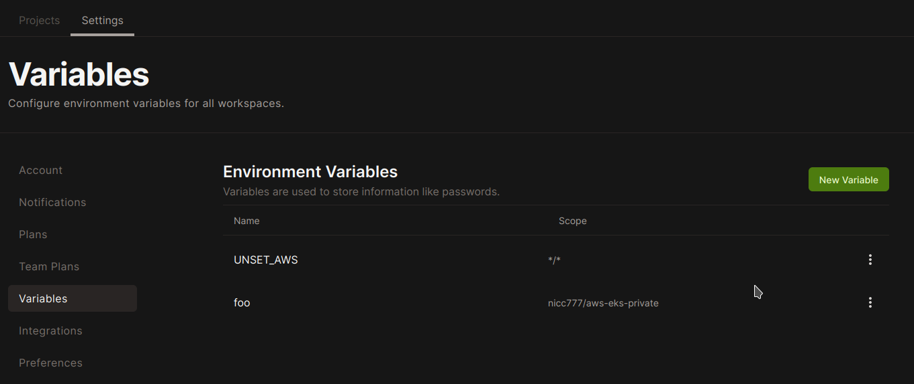

# Exploring GitPod Configuration and Workflow

In my previous [post](2022-06-07.md) I explored GitPod and I have kinda settled on it as my default Development environment. The last couple of changes in my GitHub repos were all from GitPod workspaces.

The more I use the service the more I like it. My plan is to eventually transition all my development to this service, which provides a VSCode IDE (or InteliJ) in a web browser. I have also used it now a couple of times on my iPad. I created a shortcut on the home screen which also allows the workspace to then run in full screen mode, so it feels just like a real IDE and not a web page.

One of my best best discoveries this far is how powerful the workspace configuration is.

Anyway, allow me to share some of my discoveries and explain how my current development workflow works. Perhaps you can find some useful tips or perhaps a more experiences GitPod user can show me a better way.

# Configuration

## Setting up your development environment

By accident I discovered recently when I opened a project with a `requirements.txt` file, that GitPod automatically recognized the file as the file Python uses to define dependencies. So, GitPod automatically executed the command `pip install -r requirements.txt` which installs all the dependencies. 

Incidentally, this was for this blog which I now edit only in GitPod.

But, since this is a repeatable task that is required for all workspaces that I may create in the future for this repository, GitPod also created a file called `.gitpod.yml` with the following content:

```yaml
# This configuration file was automatically generated by Gitpod.
# Please adjust to your needs (see https://www.gitpod.io/docs/config-gitpod-file)
# and commit this file to your remote git repository to share the goodness with others.

tasks:
  - init: pip install -r requirements.txt
```

As you can see from the comment, the full details on how this file works is available from the [GitPod documentation site](https://www.gitpod.io/docs/config-gitpod-file).

This was great... but I also needed the AWS CLI in order to upload site changes to AWS S3. So I modified the file and the final version now looks like this:

```yaml
tasks:
  - name: Python Requirements
    init: pip install -r requirements.txt
  - name: AWS CLI
    init: cd ~/ && curl "https://awscli.amazonaws.com/awscli-exe-linux-x86_64.zip" -o "awscliv2.zip" && unzip awscliv2.zip && sudo ./aws/install && cd $OLDPWD
```

Therefore, each time a new workspace is created that does not yet have these development dependencies installed, it will now run these commands. 

Therefore, it will not matter how many workspaces you end up using, by having your development dependencies defined as code, GitPod will ensure that these are installed as and when required for new workspaces.

## Environment Variables

For security reasons, AWS credentials must never ever be stored in your Git repository - even if it's private. I have seen what could happen if you accidentally commit credentials to GitHub and it's not pretty!

At the same time, I am still contemplating how I want to do this in GitPod, but fow now I settled on manually defining my GitPod Environment variables for AWS credentials.

However, there are some environment variables that I do want to set on every workspace. One such variable is for a command I want to run to clear all AWS environment variables from time to time - perhaps because I want to switch to another set of credentials but mostly as I don't like sensitive information like this floating around in cyberspace too long.

GitPod allows you to define environment variables with scope, as you may be able to see from the screenshot below:



Now, whenever I start a workspace, and depending on the scope and the actual workspace, the environment variables will be exposed based on this configuration.

While you are in a workspace, you can see all the exposed variables by running the command `gp env`. It is similar to just the normal `env` command available through BASH or ZSH, but displays only the GitPod related environment variables.

In this particular example, when I run just `env` I see the following, since I already exported my AWS credentials:

```shell
AWS_DEFAULT_REGION=eu-central-1
AWS_REGION=eu-central-1
AWS_DEFAULT_OUTPUT=yaml
AWS_PAGER=less
AWS_SECRET_ACCESS_KEY=xxxXXXxxxXXXxxxXXXxxxXXX
AWS_ACCESS_KEY_ID=xxxxxxxxxxxxxxxxxxxx
UNSET_AWS=unset AWS_DEFAULT_REGION ; unset AWS_REGION ; unset AWS_DEFAULT_OUTPUT ; unset AWS_PAGER ; unset AWS_SECRET_ACCESS_KEY ; unset AWS_ACCESS_KEY_ID
GITPOD_TASKS=[{"name":"Python Requirements","init":"pip install -r requirements.txt"},{"name":"AWS CLI","init":"cd ~/ && curl \"https://awscli.amazonaws.com/awscli-exe-linux-x86_64.zip\" -o \"awscliv2.zip\" && unzip awscliv2.zip && sudo ./aws/install && cd $OLDPWD"}]
```

To unset my AWS credentials, I run the following command: `eval $UNSET_AWS`

_**Security Warning**_: Using eval can be dangerous, so please familiarize yourself with the full consequences. On [stackoverflow](https://stackoverflow.com/questions/17529220/why-should-eval-be-avoided-in-bash-and-what-should-i-use-instead) I found a very interesting thread discussing the potential issues.

After running the command, the critical variables are no longer available in the terminal session I use. Keep in mind also where you use the environment variables - as in which terminal sessions.

# Tags

xxx

<div id="disqus_thread"></div>
<script>
    /**
    *  RECOMMENDED CONFIGURATION VARIABLES: EDIT AND UNCOMMENT THE SECTION BELOW TO INSERT DYNAMIC VALUES FROM YOUR PLATFORM OR CMS.
    *  LEARN WHY DEFINING THESE VARIABLES IS IMPORTANT: https://disqus.com/admin/universalcode/#configuration-variables    */
    /*
    var disqus_config = function () {
    this.page.url = PAGE_URL;  // Replace PAGE_URL with your page's canonical URL variable
    this.page.identifier = PAGE_IDENTIFIER; // Replace PAGE_IDENTIFIER with your page's unique identifier variable
    };
    */
    (function() { // DON'T EDIT BELOW THIS LINE
    var d = document, s = d.createElement('script');
    s.src = 'https://nicc777.disqus.com/embed.js';
    s.setAttribute('data-timestamp', +new Date());
    (d.head || d.body).appendChild(s);
    })();
</script>
<noscript>Please enable JavaScript to view the <a href="https://disqus.com/?ref_noscript">comments powered by Disqus.</a></noscript>