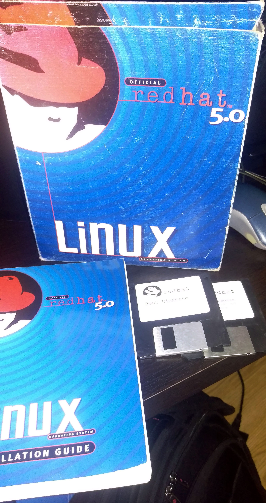
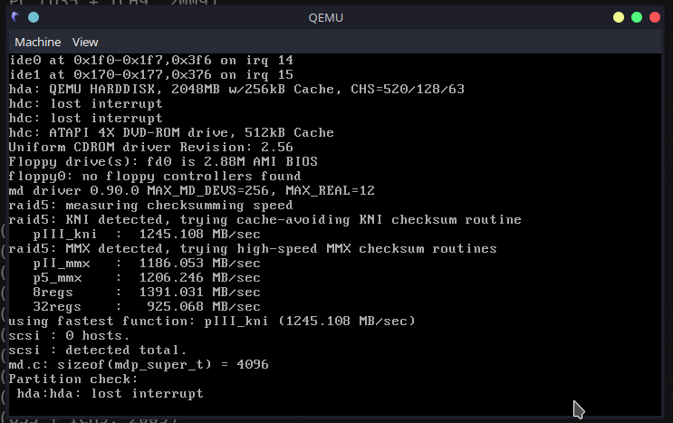
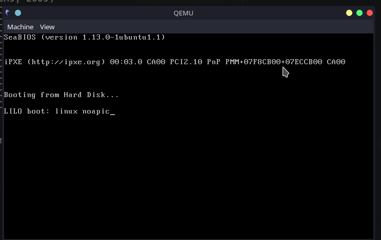
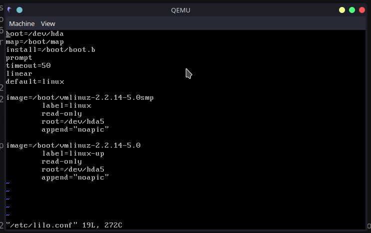
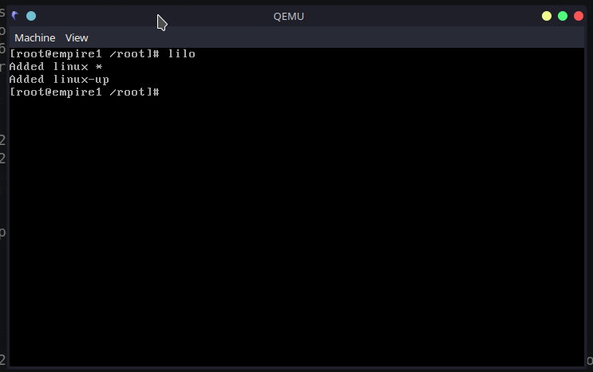

# Tech Nostalgia: Qemu and RedHat Linux 6.2 (circa 2000)

## Welcome to 199x

I am really getting to enjoy the retro computing experiments. It takes a lot of time getting things to work, but the whole experience takes me back to the same struggles 20+ years ago. Of course back then it was even more difficult to get your hands on a solution that works. Sometimes it would take days or even weeks since I did not have daily access to the Internet and books or other documentation on hand sometimes only go sofar. But the feeling of satisfaction afterwards when everything is working is just amazing and I think it is that rush that keeps people like me pushing to try the next thing.

This past week I shifted my focus to the server side. I decided on a distribution that really got me into Linux in the first place - RedHat. My very first Linux distribution was RedHat Linux 5.0 and I actually owned an official boxed set.



The floppy discs, by the way, was needed for me as I had a 486 Laptop with a CD-ROM connected via the printer port. The floppy disc contained software to work from a DOS boot-up that would then enable the CD-ROM from where you could then install RedHat. See the video at the end for a typical laptop of the mid 90's and the experience you could expect.

Unfortunately I no longer have the original boxed set, but I settled on a version from [WinWorld](https://winworldpc.com/product/red-hat-linux/50).

## Qemu

The last time I tested Pcem, but this time I thought I would give [qemu](https://www.qemu.org/) a go.

My Initial configuration was in a file called `qemu.sh` and the content is below:

```text
qemu-system-i386 \
        -monitor stdio \
        -M pc-i440fx-6.0 \
        -hda c.img \
        -cdrom RedHatLinux-Intel-505.iso \
        -boot d \
        #-boot c \
        -cpu pentium2 \
        -m 128 \
        -vga cirrus \
        -net nic,model=ne2k_pci,irq=10,iobase=0x300,id=mynic \
        -net user \
        -rtc base=localtime
```

_**Note**_: I think most options are pretty self explanatory, but please consult the documentation for your own fine tuning needs. I keep both `-boot` options in the file and only use one at a time (one is commented out). Also, even though I made 128MB RAM available, Linux 5 only used 64MB in the end.

The hard drive I created with the following command:

```shell
qemu-img create -f qcow2 c.img 512M
```

Yes - a 512MB hard drive was more than enough back in the day. This would have a web server, news server and even a complete X-server installed - with room to spare. In terms of partitioning, I used the following:

| Mount Point | Type         | Size & Notes |
|+-----------+|+------------+|--------------|
| `/boot`     | Linux Native | 50MB         |
| `/`         | Linux Native | 398MB        |
| swap        | swap         | 64NB         |

After a typical install, including almost everything, you should only use between 50% or 60% of the available space in the root partition.

After first boot I found that my RAM usage was still very low at 10MB and the system was not swapping at all.

It is actually amazing the bang for buck we got back then!

By the way, to shut down the system, you will need to run the command `shutdown -h 0`.

# Also trying RedHat 6.2

I also tried RedHat 6.2 on the same hardware, with the only difference being that I gave it a 2GB hard drive.

One "hack" I required had to do with some funny hard drive behavior/errors I got that required a `lilo` entry as can be seen in the screenshots below:

The first screenshot shows the error: `hda: lost interrupt`



The initial fix: enter `linux noapic` to the initial boot screen:



Make the change permanent in the `/etc/lilo.conf` file:



Remember to make the change "active" by running `lilo`:



Another reboot and everything was now just fine!

# What still needs to happen

The one big challenge I still have to solve is networking. That will be my focus for the next week, time permitting. I also still need to spend some time again on another project - but in all honesty this was such a nice distraction, it's very hard to turn to my other pet projects at the moment. It really brought back so much really good memories! So, it's now carrying on trying, just like all those years ago, until I have a solution that I can deploy in a continuos deployment fashion and then start to bring some old services like NNTP, FTP and HTTP to life, which I hope to consume from Windows 98!

# More Resources

A typical 386 or 486 laptop experience in the 90's

<iframe width="560" height="315" src="https://www.youtube.com/embed/tGNCatjwGyM" title="YouTube video player" frameborder="0" allow="accelerometer; autoplay; clipboard-write; encrypted-media; gyroscope; picture-in-picture" allowfullscreen></iframe>

RedHat Linux - a short history:

<iframe width="560" height="315" src="https://www.youtube.com/embed/25B4ma9-45g" title="YouTube video player" frameborder="0" allow="accelerometer; autoplay; clipboard-write; encrypted-media; gyroscope; picture-in-picture" allowfullscreen></iframe>

Installing RedHat on really old hardware:

<iframe width="560" height="315" src="https://www.youtube.com/embed/8pz6EV5bNOY" title="YouTube video player" frameborder="0" allow="accelerometer; autoplay; clipboard-write; encrypted-media; gyroscope; picture-in-picture" allowfullscreen></iframe>

# Tags

nostalgia, redhat62, qemu, emulation, emulators

<div id="disqus_thread"></div>
<script>
    /**
    *  RECOMMENDED CONFIGURATION VARIABLES: EDIT AND UNCOMMENT THE SECTION BELOW TO INSERT DYNAMIC VALUES FROM YOUR PLATFORM OR CMS.
    *  LEARN WHY DEFINING THESE VARIABLES IS IMPORTANT: https://disqus.com/admin/universalcode/#configuration-variables    */
    /*
    var disqus_config = function () {
    this.page.url = PAGE_URL;  // Replace PAGE_URL with your page's canonical URL variable
    this.page.identifier = PAGE_IDENTIFIER; // Replace PAGE_IDENTIFIER with your page's unique identifier variable
    };
    */
    (function() { // DON'T EDIT BELOW THIS LINE
    var d = document, s = d.createElement('script');
    s.src = 'https://nicc777.disqus.com/embed.js';
    s.setAttribute('data-timestamp', +new Date());
    (d.head || d.body).appendChild(s);
    })();
</script>
<noscript>Please enable JavaScript to view the <a href="https://disqus.com/?ref_noscript">comments powered by Disqus.</a></noscript>