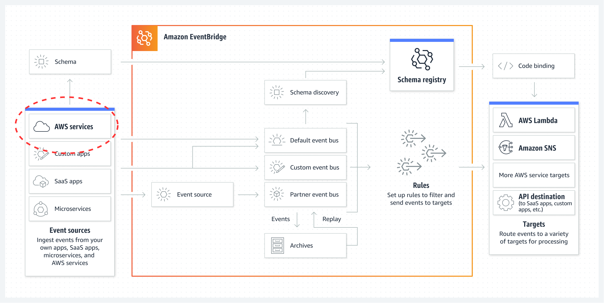
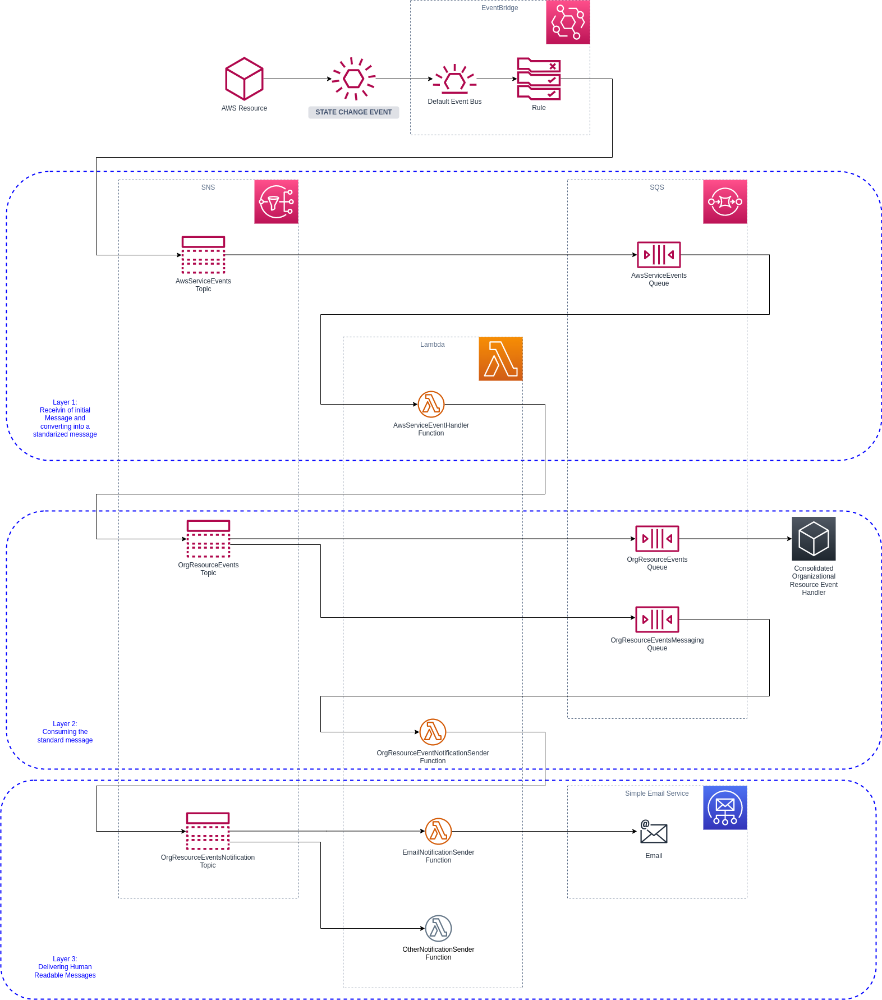
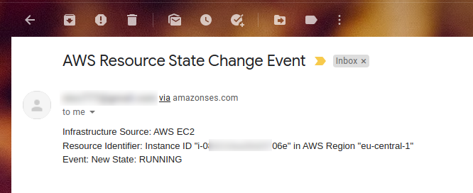
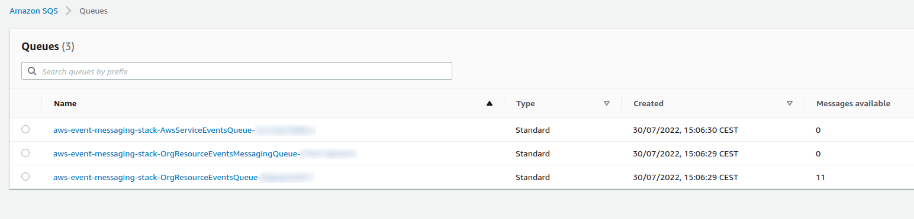

# Event Driven Operations - An Example in AWS

A lot has been written about Event Driven Architecture and it is hard to point to a single great resource. Therefore, to save space on my blog (and preventing it from becoming a book), I will just share the following resources for those who would like to familiarize themselves with the concept and theory:

* [What do you mean by “Event-Driven”?](https://martinfowler.com/articles/201701-event-driven.html) by Martin Fowler (2017-02-07)
* [Wikipedia: Event-driven architecture](https://en.wikipedia.org/wiki/Event-driven_architecture) by various authors ([edit history](https://en.wikipedia.org/w/index.php?title=Event-driven_architecture&action=history))
* Various industry takes on the subject:
  * [Red Hat](https://aws.amazon.com/event-driven-architecture/)
  * [AWS](https://www.redhat.com/en/topics/integration/what-is-event-driven-architecture) 
  * [MS Azure](https://docs.microsoft.com/en-us/azure/architecture/guide/architecture-styles/event-driven)
  * [Tibco](https://www.tibco.com/reference-center/what-is-event-driven-architecture)
* [Reference Architecture Pattern](https://microservices.io/patterns/data/event-driven-architecture.html) which also notes that, at least from their perspective, it has been replaced by the [Saga Pattern](https://microservices.io/patterns/data/saga.html)

As you will see, virtually all the resources focus on this pattern from an application perspective. RedHat and AWS hints toward an operational context, but overall I found very little solid references that focus on operational contexts for those of us who have to manage infrastructure, cloud platforms etc.

As we move toward [Infrastructure as Code](https://www.redhat.com/en/topics/automation/what-is-infrastructure-as-code-iac) I think it is worthwhile for DevOps and SRE engineers to also better understand the concept of event driven architecture and patterns, as we also are starting to produce more and more code (and logic). By the way, I specifically link to the Red Hat resource here, as I believe they have a really short but accurate description of the two dominant types of IaC at the moment: declarative and imperative.

What I want to explore in this post is an example of how anyone that has to look after the operations of a platform can leverage the event driven pattern in their operational model. I will focus on AWS, as this is where my experience currently lies - but the principles can very well be applied in any environment.

# Example Scenario

For this specific blog post, I am not too concerned about IaC - I assume it is something that you already do - at least to some extend. If you are not yet on the IaC boat, I would suggest you learn about it as it will change your life! However, your environment, choice of tools etc. will largely dictate if you lean toward a declarative or an imperative IaC strategy. It could even be both! However, since I will be focusing on AWS and use [SAM](https://aws.amazon.com/serverless/sam/) for the examples, you have to keep in mind that this approach is, in my opinion, a little bit of a mix between the two. AWS themselves [will define CloudFormation as declarative](https://docs.aws.amazon.com/whitepapers/latest/introduction-devops-aws/infrastructure-as-code.html) while tools like SAM leans more toward the definition of imperative - even though the final output is CloudFormation templates.

So, without going to deep into these differences any further, I will look at AWS as an example and focus on how we can know that something we defined as IaC changes state - for whatever reason. The idea will be to send a properly formatted notification - standardized to our own specification, to something that can collate all this data. I am not going to propose a solution for how this is finally collected - there are many options and each organization have their own mix. However, the concept and examples up to that point should be fairly portable for AWS users.

In AWS we deploy virtual infrastructure as a service. AWS has hundreds of services, like EC2 (virtual machines), ELB (Application and Network Load Balancers) etc. During a deployment, resources will be created. For example, in the EC2 service, resources like virtual machines, block storage devices, network interfaces etc. are created and all of these resources are required for the resource to work properly.

From a service perspective, each of the resource types in the services can be in different states at different times and in general there are states for a resource being provisioned, then one for it being in a running and stable state and finally a state for when a resource is being de-provisioned (stopped, deleted or whatever other terminology is fitting).

In AWS, when resources changes state, many of such services that the resources belong to can emit an event. This event can be handled by another AWS Service known as the [AWS EventBridge](https://aws.amazon.com/eventbridge/). You will see from the service description that the service is really pitched once again at application solutions. However, if you look at the conceptual diagram (copy below), you will clearly see `AWS Services` as an event source:

The AWS EventBridge can get very involved, but from our perspective we are only interested when a resource in AWS changes state. We want to get informed about it and be able to react to it.

In my example, I will demonstrate how we can get the basic pieces put together to capture AWS service events, transform the even message to a standard form and finally deliver that standardized message in a way that can be consumed by virtually any other third party application.

At this point, it is also important to know which services and resources is capable of producing events. A list of supported services is available [in the AWS documentation for EventBridge](https://docs.aws.amazon.com/AmazonCloudWatch/latest/events/EventTypes.html). As can be seen in the diagram above, AWS service events are directed to the default event bus.

In the example scenario we will look at [the EC2 service](https://docs.aws.amazon.com/AmazonCloudWatch/latest/events/EventTypes.html#ec2_event_type) and we see for this service, the following states will produce events:

* `running`
* `shutting-down`
* `stopped`
* `stopping`
* `terminated`

Some of these states are transition states or temporary. In a transition state, the service may sometimes appear to be still operating normally. This depends a lot on the actual service and how it is configured. For example, an EC2 instance in the `shutting-down` state may still have a working SSH service and if you time it right, you may even still be able to log into the instance while in this transitioning state - however short lived your session may be!

# Solution Design

## Thinking about our design: goals, tools, patterns etc.

Coming up with an event driven solution can be hard. It takes some time to identify all the various components required and you also have to force yourself to think about potentially other scenarios in which each microservice could be used. The idea is to create services that can operate independently, each reacting to events. 

I probably sneaked in the term `microservice` there, but at the end of each event, the consumer is typically a microservice.

Another consideration is specifically around the environment the solution will be deployed in. In this case, the target is AWS and the example solution will therefore be specifically tailored for this environment.

Therefore, the AWS EventBridge, as already mentioned, is more or less our starting point. The Default Event Bus will receive events that we configure and then we have to do something with that event. The core AWS components at play will be:

* [AWS SNS](https://docs.aws.amazon.com/sns/latest/dg/welcome.html) - A service that can handle a lot of message throughput. A typical pattern is for SNS to send messages to SQS queues or to Lambda Functions directly. The better pattern most of the times is a SNS->SQS->Lambda type pattern. If the Lambda function produces additional messages, these would typically be send to another SNS topic. The reason SNS is popular is that we can use SNS to fan-out messages to multiple destinations. This feature will also be demonstrated in the example.
* [AWS SQS](https://docs.aws.amazon.com/AWSSimpleQueueService/latest/SQSDeveloperGuide/welcome.html) - A message queueing system which is highly durable. For messages that absolutely has to be processed, those messages should end-up in SQS for other services to consume. Lambda functions can easily consume SQS queued messages. The service has a lot of advanced features, but the example only demonstrates some of the most basic usage scenarios. SQS supports features such as dead letter queues, but these are not in the example.
* [AWS Lambda](https://docs.aws.amazon.com/lambda/latest/dg/welcome.html) - Basically allows you to run code without the need to configure servers. In my opinion, Lambda functions are also ideal as a microservice implementation. In this context, the Lambda function must only provide a single core function, like sending an e-mail message. The function should be able to operate properly on it's own without relying on any other functions. Orchestration of processes that rely on various Lambda functions in order to accomplish a complex task can be done in one of two way: 1) By sending messages via SNS/SQS mechanisms (what the example will utilize); or 2) orchestrated by using [step-functions](https://docs.aws.amazon.com/step-functions/latest/dg/welcome.html). 

A note about SNS Fan-Out: This is a very powerful feature and in our example, we will use it for a hypothetical scenario where the processed event notification is sent to 2x SQS queues: one will be intended for a system based consumption like a monitoring and alerting system which requires the message in a computer readable format, like CSV, while the other queue is intended for message delivery to humans in a more readable format. 

Finally, for the service to be extended you will probably have to deal with a variety of source event message structures. Each piece of infrastructure have their own message body and statuses. It is therefore useful to consider how messages can be converted into a standard form in order for all downstream processing to deal with only one message format. This is of course again only an option and the example will illustrate a very basic concept of this, but taking an initial source message and condense it into a simple three column CSV message, where column one indicates the source Infrastructure class that generated the event (for example `aws.ec2`), column two holds the AWS ARN of the resource and finally column three holds a processed form of the state/event. In the example, the  Lambda functions only process EC2 events and if you experiment with added more resource types to the event bridge, you will have to consider adding logic to handle those message formats properly as well.

## Solution Design Diagram

In conclusion, a possible solution could take the following form - which is also the template solution used for our example:

The diagram has a number of components, and we can now start to examine each of them. A typical flow, as should be obvious, is from top-to-bottom and left-to-right.

### The Overall Process

The entire diagram represents an `Infrastructure Event Notification Process`. Once some event occurs in our Infrastructure, a hypothetical monitoring system as well as humans will be interested in some or all of these events.

Initially, only EC2 events are configured and the various Lambda functions more-or-less expects only these types of events.

Certain components, like the `EmailNotificationSender` Lambda Function, is very generic and could potentially be re-used in many other processes. In terms of project organization, you might want to keep this specific microservice in a dedicated project where it can be maintained independently of other functions making up this `Infrastructure Event Notification Process`. This is why I like to start with diagrams like this: it allows us to identify these special events and allow us to think what to do with them. In a simple example like I have here, and with no other processes in site, the specific service is kept in a single project.

### Event Generation/Source

The AWS Infrastructure produces events as the infrastructure in question changes state. For example, an EC2 instance previously in a `running` state is terminated and is now in a `terminated` state.

In the example project, the EVentBridge will be configured to handle only EC2 events for any EC2 state and these will be send to `AwsServiceEvents SNS topic`.

### The First Layer: Process Initial Source Message and Produce a Standard Message

The `AwsServiceEvents SNS topic` will immediately forward all messages to the `AwsServiceEvents SQS Queue`. There is an AWS Lambda function called `AwsServiceEventHandler` which will consume SQS messages and attempt to produce a standardized message. The standardized message will be send onto the `OrgResourceEvents SNS Topic`.

The motivation for this design allows for a level of decoupling where we can now also re-use layer 2 and 3 by other non-AWS infrastructure resources that also produce state events that are of interest. For example, you can now consider channeling some of your on-premise infrastructure events (like the trusty old SNMP Traps) to AWS to all be handled now in a consistent way. This, by the way, can be a strategy forming part of a data center migration to the cloud exercise and allows you to implement an interim step to first consolidate the management of all infrastructure events across your entire estate.

### The Second Layer: Consume and Process the Standard Message

In this layer we now have a standard message on the SNS topic and here is our first example of a fan-out strategy that we can employ for SNS. More specifically, we now want to split our message for consumption of two very different end-users: one is expected to be a "machine" and will process the standard message as-is which the second end-user is expected to be a human that needs a little more human like message - perhaps with a simplified version of the state of a service.

The standard message (which is also the machine readable version) will be send to the `OrgResourceEvents SQS Queue`. Nothing is consuming this queue at the moment, so messages will just build up until the reach their expiry. This level of decoupling will also allow another team to independently work on the consuming part - and all they have to know is the message structure and the ARN of their queue. Therefore, our implementation also need to make the queue binding information available and this is typically achieved by CloudFOrmation `Outputs`.

There is also a second `OrgResourceEventsMessaging SQS Queue` which is consumed by the `OrgResourceEventNotificationSender Lambda Function` and who's purpose is to convert the standard message into a human readable version that can be sne don by down stream services. The resulting message will be published to the `OrgResourceEventsNotification SNS Topic`.

### The Third Layer: Sending Human Readable Messages

The final layer could potentially be maintained by a completely independent team in even in a separate project, as mentioned before. In this example, the `OrgResourceEventsNotification SNS Topic` sends the message directly to a Lambda function that can send the e-mail message to SES. In a similar way you could add additional Lambda functions that can integrate with many other services, like Slack, MS Teams or Zoom (and many many others).

## Other Considerations

### What happens if the Standard Message needs to change?

The example is really simplified, but each of the topics and queues can be versioned in various ways. For this specific solution I would prefer completely separate topics and queues for each message version. For example, the `OrgResourceEvents SNS Topic` can have a second version later called `OrgResourceEventsV2 SNS Topic`. In turn the `OrgResourceEventsV2 SNS Topic` will now publish messages to the queues `OrgResourceEventsV2 SQS Queue` and `OrgResourceEventsMessagingV2 SQS Queue` and the teams implementing the Lambda function and/or other systems consuming these messages can over time integrate their solutions to consume from these queues.

This approach allows for decentralized and decoupled teams to work each at their own pace without any hard dependencies.

Also note that at this stage, the lambda function that starts to consume the `OrgResourceEventsMessagingV2 SQS Queue` can very well still produce version one messages for the `OrgResourceEventsNotification SNS Topic` - but now taking into account a new message structure from upstream events. The Lambda function sending e-mails is completely oblivious to the changes in the layers above it.

### I need more data...

Sometimes the data contained within a message is very limited and you may want to enrich the data - especially when sending as an e-mail. For example, the message contains only the resource ARN and in this case an Instance ID. For a human that will read the message an instance ID may mean nothing. So perhaps in his case you may want to query the EC2 instance and add some information available from it's tags, like the Instance Name (if set). 

Talking about tags, tags can also be considered for other processing logic for example resources with a certain tag can be ignored.

Tagging can also be used in more advanced message routing options by tagging each resource with a department or business unit owner. Depending on the value of such a tag, different topics and queues can be targeted to meat different needs from these resource owners.

Whatever the case, the lambda function may have to be extended to query the specific resource to obtain the required data in order to add to the message. Keep in mind that such additional functionality may require you to consider the following:

* Extend the timeout of the Lambda function
* More RAM may be required

Finally, more api calls will also incur more costs and however negligible this may be it all adds up in the end.

# Implementation

AWS has a fairly large collection of [example SAM templates](https://github.com/aws-samples/serverless-patterns) in their `serverless patterns` repository. I used these to get started quickly with [my own example repository](https://github.com/nicc777/aws-event-messaging-example) for this exercise.

The specific examples I used included the following:

* [eventbridge-sns](https://github.com/aws-samples/serverless-patterns/tree/main/eventbridge-sns) example
* [sns-sqs](https://github.com/aws-samples/serverless-patterns/tree/main/sns-sqs) example
* [sqs-lambda](https://github.com/aws-samples/serverless-patterns/tree/main/sqs-lambda) example
* [lambda-sns-lambda](https://github.com/aws-samples/serverless-patterns/tree/main/lambda-sns-lambda-sam-java) example
* [lambda-ses](https://github.com/aws-samples/serverless-patterns/tree/main/lambda-ses) example

The deployment notes are in the [example repository](https://github.com/nicc777/aws-event-messaging-example)

There are some shortcomings of the example implementation and it is worthwhile discussing some of them briefly:
  
* When a Lambda functions consuming messages from SQS throws an exception, the message will remain in the queue. Since the Lambda function only consumes up to 10 messages at a time, processing may eventually stop if the queue is full of messages (more than 10) that cannot be processed. The fix for this problem is to move these messages to a dead letter queue, but this is not implemented and this is left as an exercise for the reader.
 * When Lambda functions that consume SNS messages directly throw an exception, those messages risk being lost. It is up to the reader to think about and implement an appropriate redundant message handling solution, should one be required. The current example of SNS-to-Lambda demonstrates a "best-effort" type SLA with no guarantees. The SNS-SQS-Lambda approach has a much better guarantee, but take note of the limitation notes above.
 * AWS SAM has a lot of features including local running and testing capabilities. These are not implemented in the example.

# Testing

Post deployment, remember to set the sender and receiver e-mail addresses in the `EmailNotificationSender Lambda Function` Environment Variables. If the account still uses the SES sandbox, the e-mail address(es) needs to be verified.

Some example test scenarios:

* Creating an instance 
* Stopping an EC2 Instance
* Restart the instance
* Create an instance tagged to be ignored
* Terminating all our instances

Each time one of these events occur, you should receive an e-mail, similar to the one shown below:

Because there is no application consuming messages in the `OrgResourceEvents SQS Queue`, there should also be a message buildup, as can be seen below:

# Further Important Points

Seeing the demonstration in action is great, but keep in mind that examples like these just scratch the surface and they are only there to describe a concept in a practical and simple way that anyone could test out and play with. There are a number of other items to consider when moving from this example to a full solution, including:

* Added more services: The example only use EC2 events, but most likely users of AWS Services use a lot more services. The other services needs to be added to the rule and the Lambda functions may need to be adjusted to parse the events from these services in more human readable text.
* The example only focus on a single AWS account. When you have multiple AWS Accounts, you also need to consider how you will manage your monitoring and alerting for all these accounts and one option is to deploy your SNS, SQS and Lambda resources only in one account, and then have EventBridge rules in each of the other accounts. You may have to adapt your messages to include account information in a way that makes sense.
* If keeping a record of events is important, consider perhaps an option to store all messages in S3. Look at [the Lambda to S3](https://github.com/aws-samples/serverless-patterns/tree/main/lambda-s3) example from the serverless patterns repository.
* Messaging is one option of monitoring but you could also take action when certain events occur. One example from the serverless patterns repository is to [remove public access from S3 buckets](https://github.com/aws-samples/serverless-patterns/tree/main/ta-eventbridge-lambda-s3) - a valuable security intervention that is highly recommended and a perfect example of automating security interventions in the cloud.
* Event timing is a little unpredictable at times. Things like queue buildup, network issues and other outages may affect message delivery. Keep this in mind especially if you consider employing such a solution in a critical production environment. The need for an external monitoring solution that discovers assets and actively monitors them may still be required, depending on your business goals.
* Scheduled events are also supported in EventBridge and it is just another rule. It is rather flexible in that you can specify the interval in plain english like "every 5 minutes" or use [cron](https://crontab.guru/) syntax.

# Wrapping up and conclusion

Event Driven Architecture can be really useful in IT operations where support engineers need to be made aware of certain events that occur in the environment. Cloud services like AWS provide all the tools required to use event based patterns to accomplish exactly this task. Other cloud services also have their own implementations and you can consult other sources, like [this excellent blog post](https://sjwiggers.com/2022/01/30/event-driven-services-in-the-cloud-azure-event-grid-aws-event-bridge-and-google-eventarc/) (from Steef-Jan Wiggers).

# Tags

infrastructure, iac, event driven, patterns, architecture, aws, azure, redhat, cloud, support, devops, sre

<noscript>Please enable JavaScript to view the <a href="https://disqus.com/?ref_noscript">comments powered by Disqus.</a></noscript>
