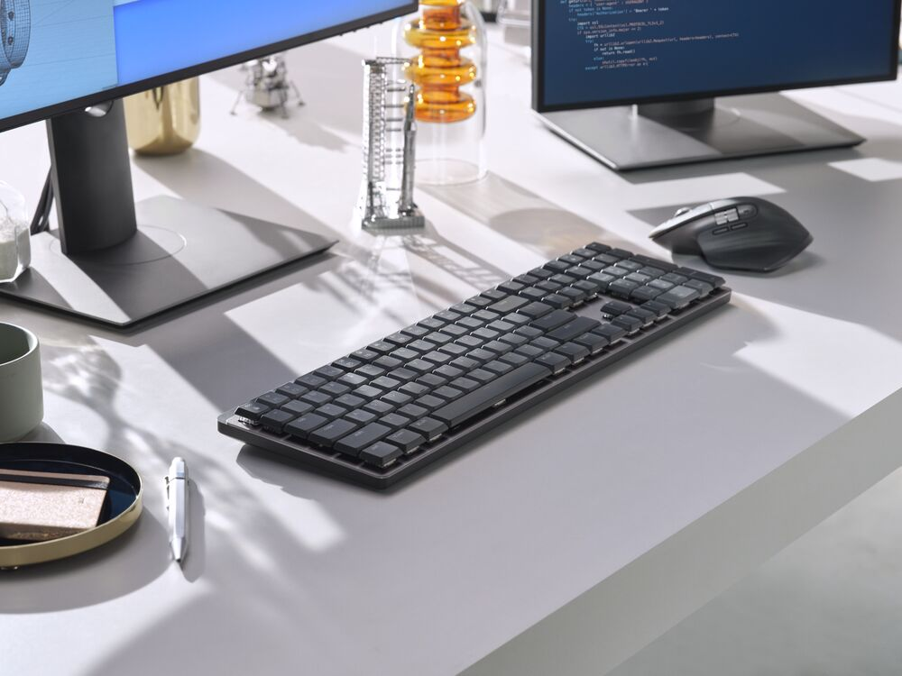

# Productivity and your Hardware

I am not really a hardware person, and for the most part I just use what is available. ANd mostly this is not an issue or something I would even think about.

However, from time to time I discover something that really makes me stop to think that I should have done it a long time ago. 

Today was such a day. Well, technically it was yesterday and some of the text in this post was written on the 20th, but I got tired and finished the post on the 21st... Such is life!

ANyway, back to the life changing hardware I discovered.

It cam in the form of a keyboard...

> Image credit: [Tech Pulse](https://techpulse.be/review/340417/logitech-mx-master-3s-muis-mx-mechanical-toetsenbord-test-productiviteit/) (Dutch)

## Not my first rodeo

Ok, so this is a mechanical keyboard and I did previously own a mechanical keyboard - a Corsair. Unfortunately I can't recall the exact model, as this was about two or three years ago.

I hated that keyboard. It was load and they keys was generally to high for me - in fact the whole keyboard was too high. It would have worked better with one of those arm wrest things, but I'm not a fan of those either. 

Oh, did I mention it was loud? Typing a lot means that I got really irritated by the loud clicking - to the point where I would just switch to one of my old keyboards again. 

So, needless to say, I just thought to myself that mechanical keyboards is just not for me.

I should probably also mention - I am not a PC gamer. Unless you count Patience or Sudoku... I think this was my problem perhaps - these mechanical keyboards appears to be mainly aimed at hardcore PC gamers. I can't claim to understand this really, as it is just not something I'm into.

## Discovering the MX Mechanical

As 2022 started, I invested in the Logitech MX which is also a great keyboard. However, I type a lot, and I noticed that some of the keys started to fade. I started looking around for replacement keys, and through some google searches discovered the MX Mechanical. So, basically - by pure accident!

I was skeptical, but after watching some reviews on Youtube I thought I would give the mechanical keyboard another try. What convinced me was specifically some reviews mentioning the fact that you could comfortably type on this keyboard without a hand rest or some other support. The tactile option was also a lot softer on the ears!

So, I thought to myself... let's try this one more time...

## A new, superior experience

My keyboard arrived on the 20th. I unpacked it and since I already knew how to pair it using Bluetooth I went straight ahead. The process to unbox and start typing took less than 2 minutes.

And what a pleasant surprise was this! I have by now worked my first full day on the keyboard and it's amazing. It really is not too high and although it is clicky, it is very much muted and I did not get irritated at all. It also feels as if I can type faster compared to the normal Logitech MX.

I really feel I have discovered one of the best keyboards I ever owned. It just feels so good to type on this thing!

## Final thoughts

I have owned a lot of Logitech products over the years. I still have several of their peripherals - from mice, to webcams. And of course a I owned a number of Logitech keyboards.

However, the MX mechanical is arguably the best purchase of a peripheral I have done in a while. Some might say it's too early, but after a full day of typing I think the experience is already sufficient. There are some other things I will only discover after a year or more - like the long term battery life etc. I also don't know yet about replacement keys, but since this is pretty standard switches they used, finding replacements should not be that difficult (I hope) - anyway, it should be at least a couple of months or over a year before that becomes an issue, so I will deal with it then.

The keyboard is expensive and there are a lot of cheaper options available. However, despite that fact, I am still very satisfied with the purchase. From all the keyboards I ever owned, this is so far my favorite - after just one day!

Is it for you? I don't know - we are all different and if you don't know, just go to a computer store with stock and play with it for a couple of minutes.

## Video Reviews

You might also be interested in the following videos:

The first is from `Hardware Canucks`:

<iframe width="560" height="315" src="https://www.youtube.com/embed/YpHt2s_2csY" title="YouTube video player" frameborder="0" allow="accelerometer; autoplay; clipboard-write; encrypted-media; gyroscope; picture-in-picture" allowfullscreen></iframe>

The final video is from `Justin Tse`:

<iframe width="560" height="315" src="https://www.youtube.com/embed/KKuhZfMIJ4w" title="YouTube video player" frameborder="0" allow="accelerometer; autoplay; clipboard-write; encrypted-media; gyroscope; picture-in-picture" allowfullscreen></iframe>

# Tags

personal, hardware, productivity

<noscript>Please enable JavaScript to view the <a href="https://disqus.com/?ref_noscript">comments powered by Disqus.</a></noscript>