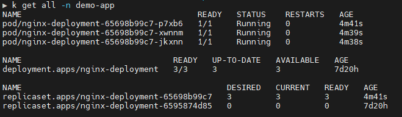
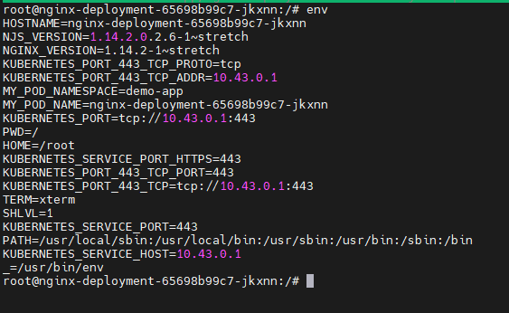
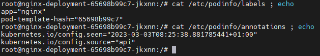

# Exposing runtime data to a Pod in Kubernetes

Sometimes you need some info about the deployment and environment for you application in the Pod.

Of course, there are multiple ways to this:

1. Integrate with the Kubernetes API (effort)
2. Expose the information at deployment time as environment variables and/or files (easier way)

The second option is good where you do not have control over the actual application, but still need the application to have access to this information. A good example is when you need to expose some label value to [filebeats (from Elastic)](https://www.elastic.co/beats/filebeat).

# Quick example

I have tested the example shown below on [k3s](https://k3s.io/) deployed on [multipass nodes](https://multipass.run/) on my local Ubuntu based development machine.

> **Note**
> I have a quick script [available here](https://gist.github.com/nicc777/0f620c9eb2958f58173224f29b23a2ff) - It will setup a k3s cluster on multipass. The process takes about 5 to 10 minutes depending on your Internet speed and system specs. Please adjust the various options in the script to suite your needs. The script is optimized for a system with at least 8 CPU cores and 16GB of RAM.

The following YAML file was taken from the Kubernetes documentation and adjusted to demonstrate how we can expose various runtime information as bot environment variables and information written in a file:

```yaml
# demo-app.yaml
---
apiVersion: v1
kind: Namespace
metadata:
  name: demo-app
  labels:
    name: demo-app
---
apiVersion: apps/v1
kind: Deployment
metadata:
  name: nginx-deployment
  namespace: demo-app
  labels:
    app: nginx
spec:
  replicas: 3
  selector:
    matchLabels:
      app: nginx
  template:
    metadata:
      labels:
        app: nginx
    spec:
      containers:
      - name: nginx
        image: nginx:1.14.2
        ports:
        - containerPort: 80
        env:
        - name: MY_POD_NAME
          valueFrom: {fieldRef: {fieldPath: metadata.name}}
        - name: MY_POD_NAMESPACE
          valueFrom: {fieldRef: {fieldPath: metadata.namespace}}
        volumeMounts:
        - name: podinfo
          mountPath: /etc/podinfo/
      volumes:
      - name: podinfo
        downwardAPI:
          items:
          - path: "labels"
            fieldRef: {fieldPath: metadata.labels}
          - path: "annotations"
            fieldRef: {fieldPath: metadata.annotations}
```

You can deploy the demo application with the following command:

```shell
kubectl apply -f demo-app.yaml
```

> **Notes**
> On my system I use a number of aliases since it can become a pain to always type out commands like `kubectl`. For this specific command I created an alias of just `k`. Refer to the [Kubectl Cheat Sheet](https://kubernetes.io/docs/reference/kubectl/cheatsheet/) for more alias examples or just search.

Some references you may be interested in researching further:

* [Define Environment Variables for a Container](https://kubernetes.io/docs/tasks/inject-data-application/define-environment-variable-container/) (Kubernetes Documentation)
* [Expose Pod Information to Containers Through Environment Variables](https://kubernetes.io/docs/tasks/inject-data-application/environment-variable-expose-pod-information/) (Kubernetes Documentation)
* [Expose Pod Information to Containers Through Files](https://kubernetes.io/docs/tasks/inject-data-application/downward-api-volume-expose-pod-information/) (Kubernetes Documentation)
* [Downward API AVailable Fields](https://kubernetes.io/docs/concepts/workloads/pods/downward-api/#available-fields) (Kubernetes Documentation)

Next is some screenshots of where we get the names of the Pods and then choose one which we can get a shell to in order to check the information now available to applications in the Pod:

## Screenshot 1 - The running pods



You can really pic any pod, as long as you can get shell access into it. More information is available in the [Kubernetes Documentation](https://kubernetes.io/docs/tasks/debug/debug-application/get-shell-running-container/)

## Screenshot 2 - Getting the environment variables from inside the pod



Once inside the Pod, you can use the standing *nix command `env` to view all the environment variables. These are typically all available to your application as well.

## Screenshot 3 - Examine the content of the file containing additional information



In this example, we created both environment variables as well as a file containing various bits of runtime information. If the command is available, you can use `cat` to view the content of the file.

# Conclusion

Of course if you are writing an application that already integrates with the Kubernetes API, you could just write the logic in your application to get the runtime information you need. However, it is far easier exposing the runtime data of the Pod by just using environment variables and/or runtime data in a file.

# Tags

kubernetes

<div id="disqus_thread"></div>
<script>
    /**
    *  RECOMMENDED CONFIGURATION VARIABLES: EDIT AND UNCOMMENT THE SECTION BELOW TO INSERT DYNAMIC VALUES FROM YOUR PLATFORM OR CMS.
    *  LEARN WHY DEFINING THESE VARIABLES IS IMPORTANT: https://disqus.com/admin/universalcode/#configuration-variables    */
    /*
    var disqus_config = function () {
    this.page.url = PAGE_URL;  // Replace PAGE_URL with your page's canonical URL variable
    this.page.identifier = PAGE_IDENTIFIER; // Replace PAGE_IDENTIFIER with your page's unique identifier variable
    };
    */
    (function() { // DON'T EDIT BELOW THIS LINE
    var d = document, s = d.createElement('script');
    s.src = 'https://nicc777.disqus.com/embed.js';
    s.setAttribute('data-timestamp', +new Date());
    (d.head || d.body).appendChild(s);
    })();
</script>
<noscript>Please enable JavaScript to view the <a href="https://disqus.com/?ref_noscript">comments powered by Disqus.</a></noscript>