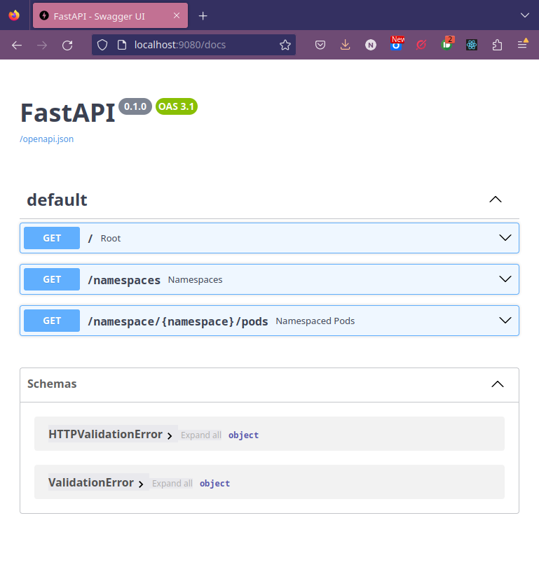
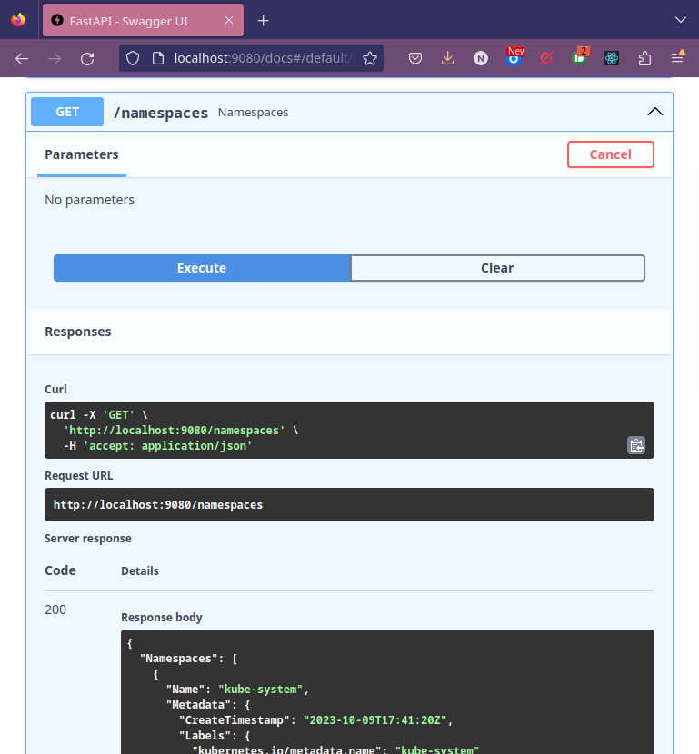
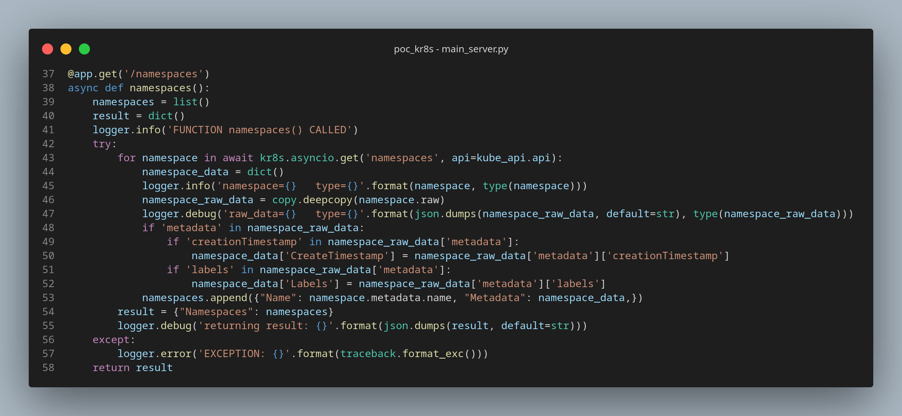
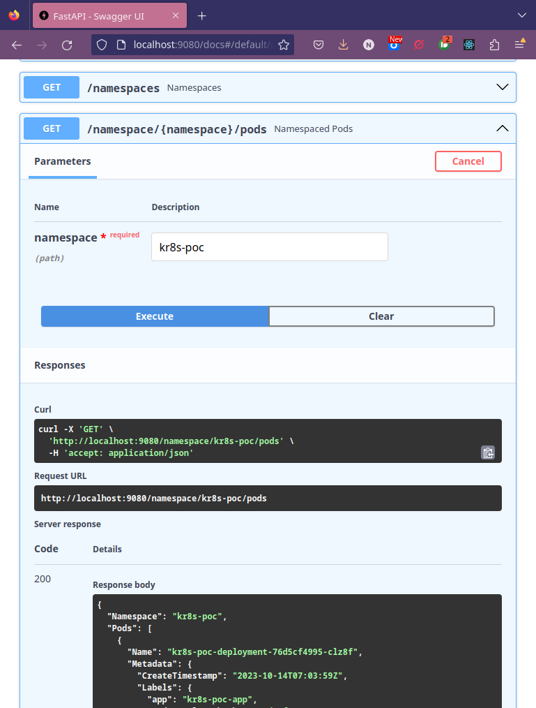

# An easier way to use Python in Kubernetes - a look at k8rs

It's always nice to discover a new tool that really make your life easier. I have looked around for an "easier" alternative to the [Python Kubernetes Client](https://github.com/kubernetes-client/python) library and I think I may just have found what I am looking for in the form of [the k8rs project](https://github.com/kr8s-org/kr8s).

# A very quick intro

As is more or less now my standard way to evaluate projects, I created a little proof of concept project to explore the basics.

> **Note**
> My experimental code is in the GitHub project [poc_k8rs](https://github.com/nicc777/poc_kr8s) - the examples I discuss and demonstrate here is based on this repository. More specifically, this blog post relates to [version v0.0.20](https://github.com/nicc777/poc_kr8s/tree/v0.0.20) of this repository.

I have made a number of observation document in the Git repository so I will not repeat them again here. In stead, I will just quickly give a more visual tour of what I found.

## Lab Context

Obviously the experiment requires some Kubernetes environment. You can use basically any Kubernetes solution, but please note that at the time of the experiment Kubernetes was at version 1.27. These notes are also inn the repository.

From a use case perspective I thought it best to keep it simple and just retrieve namespaces and also information about pods in a chosen namespace using a REST API.

In the Python world, [fastapi](https://fastapi.tiangolo.com/) is these days basically the goto solution for developing REST API's in Python. [Flask](https://flask.palletsprojects.com/en/3.0.x/) is also a very worthy alternative. Honestly I still find myself switching between the two. I always try to keep the external requirements to a minimum so my qualifying criteria is usually that if the project needs some kind of web page feature (other than a Swagger UI), `Flask` is my goto. But if it's purely REST API stuff, `fastapi` is really the best option in my opinion.

At the time of writing, the built Docker image for the project was also [on Docker Hub](https://hub.docker.com/r/nicc777/kr8s_poc), which means you could just deploy the supplied Kubernetes manifest and quickly see the demo in action. Keep in mind that far in the future, the API compatibility with newer Kubernetes version may break, so depending on when you use this example, you may have to rebuild the project and maybe even do minor tweaks in the code. Still - it should be minimal changes that is required. But if you do run into something - please consider creating a Pull Request or open an issue for me on this project site.

## Demo

Once the deployment is running in Kubernetes, the easiest way to experiment will be via curl or using your web browser to navigate to the Swagger UI. In my lab environment I had to create a port forwarder to the demo pod using the following command:

```shell
kubectl port-forward kr8s-poc-deployment-76d5cf4995-clz8f -n kr8s-poc 9080:8080
```

I used port 9080 on my local machine, but of course you could use anything that works for you. 

Below are some screenshots from the Swagger UI:

Navigating to the Swagger UI:



To get the list of namespaces, expand the blue strip that has the text `/namespaces   Namespaces` and click the `Try it out` button. Next click the `Execute` button:



The code itself should be pretty straight forward. The real magic is only in a number of lines:



Some noteworthy lines to look at in more detail:

| Line # | Description / Explanation                                                                          |
|:------:|----------------------------------------------------------------------------------------------------|
| 43     | The call to Kubernetes is done to retrieve the namespaces. Note that this is a asynchronous call.  |
| 46     | For easier data transformation I converted the data object directly to a normal Python dictionary. Earlier I had a line to log the actual dictionary content from where I could figure out what information was what I needed. That line was removed, but since every object seems to have the `_raw` keyword, you can also just look at the returned data from the log entry from line 49. |
| 48     | I had to work on a copy of the data, else the `fastapi` framework would through an exception.      |

The other endpoint works pretty much the same way, except now we are looking at a Pod from a specific namespace:



> **Note**
> I have not yet tested the behavior on very large clusters with 100's or 1000's of namespaces, and therefore I cannot comment on speed or pagination of results yet. 

# Conclusion

I really enjoyed playing with `k8rs` and found it fairly easy to learn the library. I am sure it will also be a much easier way to start with this library as apposed to something like the more official [Python Kubernetes Client](https://github.com/kubernetes-client/python).

While I explored `k8rs` I also got another change to play with `fastapi` and `uviconr` in a slightly different way to what I have used it up to now, and that was also a fairly nice experience.

These tools will definitely start to play a more prominent role in my day to day work with supporting and developing for Kubernetes.

# Tags

kubernetes, python, fastapi, uvicorn

<div id="disqus_thread"></div>
<script>
    /**
    *  RECOMMENDED CONFIGURATION VARIABLES: EDIT AND UNCOMMENT THE SECTION BELOW TO INSERT DYNAMIC VALUES FROM YOUR PLATFORM OR CMS.
    *  LEARN WHY DEFINING THESE VARIABLES IS IMPORTANT: https://disqus.com/admin/universalcode/#configuration-variables    */
    /*
    var disqus_config = function () {
    this.page.url = PAGE_URL;  // Replace PAGE_URL with your page's canonical URL variable
    this.page.identifier = PAGE_IDENTIFIER; // Replace PAGE_IDENTIFIER with your page's unique identifier variable
    };
    */
    (function() { // DON'T EDIT BELOW THIS LINE
    var d = document, s = d.createElement('script');
    s.src = 'https://nicc777.disqus.com/embed.js';
    s.setAttribute('data-timestamp', +new Date());
    (d.head || d.body).appendChild(s);
    })();
</script>
<noscript>Please enable JavaScript to view the <a href="https://disqus.com/?ref_noscript">comments powered by Disqus.</a></noscript>